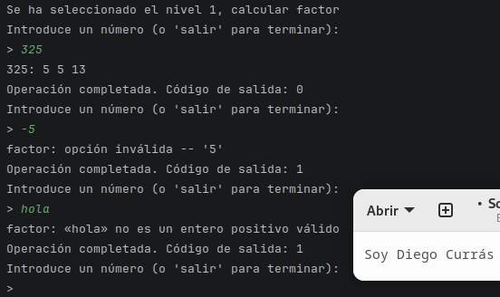
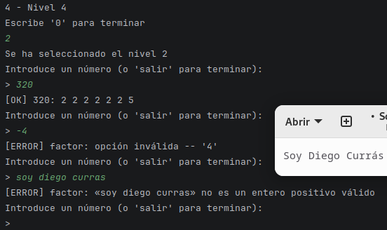
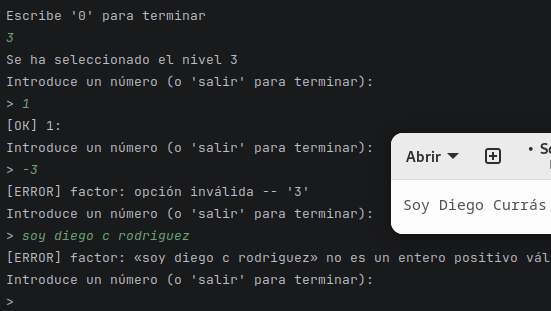
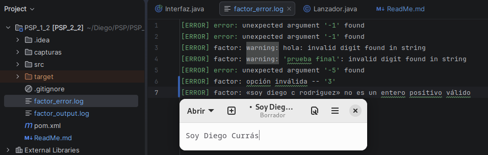
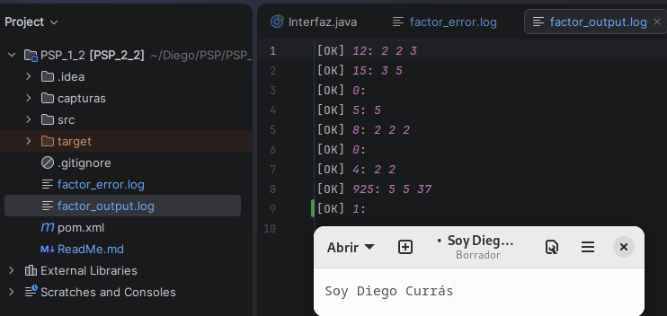
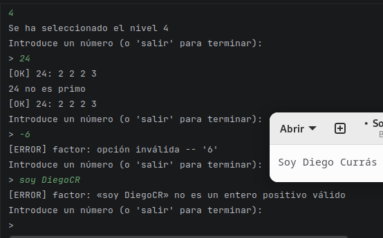

### Aclaración Express
No tengo Linux en casa, por lo que usé WSL, sin embargo la version de factor de WSL no es la misma que la de Linux, por lo que la salida de pb.redirectErrorStream(true); no es la misma
por eso devuelvo líneas distintas en Salida de Factor de hola y -5, en el instante que toque la clase con el S.O. en Linux lo cambiaré

| Valor | Salida de Factor | Código de Salida | 
| :--- | :--- | :--- |
| **360** | 360: 2 2 2 3 3 5 | Código de salida: 0 | 
| **1** | 1: | Código de salida: 0 |
| **17** | 17:17 | Código de salida: 0 |
| **hola** | factor: warning: hola: invalid digit found in string   <b>Linux</b>: factor: «hola» no es un entero positivo válido| Código de salida: 1 |
| **-5** | error: unexpected argument '-5' found   <b>Linux</b>: factor: opción inválida -- '5'| Código de salida: 1 |

---
### Incidencia 1
#### En el proceso del código me di cuenta de que no había sacado el error al poner un valor NO Intger en el factor, por lo que al poner hola salía null, cuendo tendría que salir "factor: 'hola' is not a valid positive integer", y claro, lo mismo pasó con -5
#### Esto se solucionó añadiendo la línea "pb.redirectErrorStream(true);", con esta línea se consigue el mensaje de error de terminal.

### Incidencia 2
#### Hubo un momento realizando las pruebas donde puse SALIR en ved de salir
#### Por lo que acabé cambiando el .equals por .equalsIgnoreCase()

## Nivel 1
Aquí simplemente calcularemos el factor de un número

## Nivel 2
En caso de operación válida [OK], en caso contrario [ERROR]

## Nivel 3
En caso de operación válida guardamos el resutado en factor_output.log, en caso contrario factor_error.log

Muestra de fichero de error

MUestra de fichero de output

## Nivel 4
En caso de operación válida calcular si es primo

